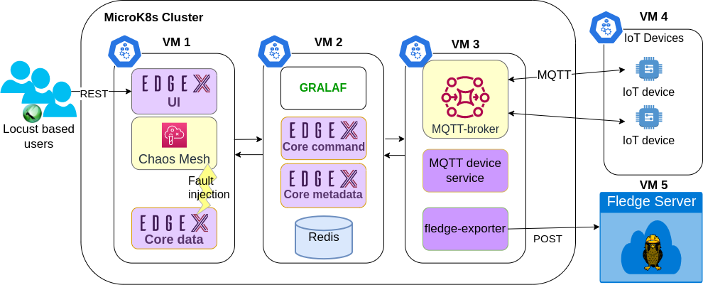

# Graph Based Liability Analysis Framework (GRALAF)

-----------------------------------------

GRALAF tracks metrics and compares them with the given Service Level Agreement (SLA) data from TRAILS. 

In the case of an SLA violation, it performs RCA based on CBN and reports to an external liability service about the corresponding violation with the estimated probability of fault types for each service being responsible for the incident. 

It is developed in Python and can be deployed in the same Kubernetes environment with the Edgex services.

## :wrench: Deployment

