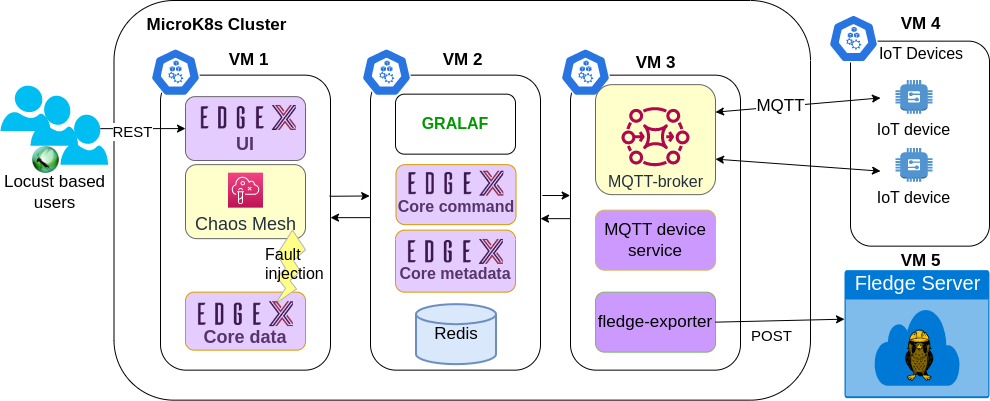

# Graph Based Liability Analysis Framework (GRALAF)

-----------------------------------------

GRALAF tracks metrics and compares them with the given Service Level Agreement (SLA) data from TRAILS. 

In the case of an SLA violation, it performs RCA based on CBN and reports to an external liability service about the corresponding violation with the estimated probability of fault types for each service being responsible for the incident. 

It is developed in Python and can be deployed in the same Kubernetes environment with the Edgex services.

## :wrench: Deployment

We utilized five VMs for the entire test setup in an OpenStack cloud infrastructure.

Three of the VMs(VM1-3) are used to deploy the MicroK8s cluster environment which hosts Edgex and GRALAF microservices along with all the necessary system components such as Prometheus, Chaos Mesh, and Istio. 

VM4 hosts another MicroK8s environment where 25 MQTT-based virtual IoT device applications are deployed. 

VM5 hosts Fledge server.

The resource specifications for VM1, VM2, and VM3 are 4 vCPU, 8GB RAM, and 160GB SSD storage. 
For VM4 and VM5, each has 1 vCPU, 2GB RAM, and 120GB SSD.
